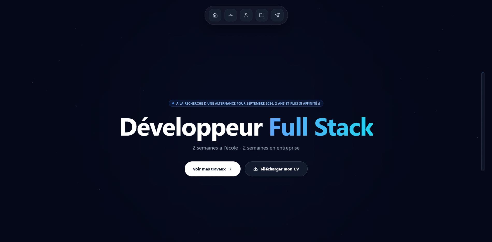

# 🚀 Portfolio Personnel - Maxime LUNEAU

Bienvenue sur le dépôt de mon portfolio interactif. Ce projet a été conçu pour présenter mon parcours, mes compétences techniques et mes réalisations en tant qu'étudiant en **Bachelor Pro Développeur Full Stack** à l'ESEO Angers.

 ## 🛠️ Stack Technique

## 🧠 Apprentissage & Méthodologie

Ce projet s'inscrit dans ma démarche d'apprentissage en autonomie. Étant actuellement en première année de Bachelor, j'ai choisi de sortir de ma zone de confort en utilisant des technologies non encore abordées en cours pour le moment :

* **Auto-formation :** Apprentissage des bases de **React**, **Tailwind CSS** et de la bibliothèque d'animation **Framer Motion** spécifiquement pour ce projet.
* **Utilisation de l'IA :** Ce portfolio a été réalisé avec l'assistance d'une Intelligence Artificielle. J'ai utilisé cet outil comme un "binôme de programmation" pour structurer mon code, comprendre les concepts de hooks React (`useState`, `useRef`) et déboguer les problématiques de responsive design.
* **Objectif :** Allier ma curiosité technique à des outils modernes pour produire un résultat professionnel tout en accélérant ma montée en compétences.

Ce portfolio a été développé avec des technologies modernes pour garantir performance, interactivité et un design soigné :

* **Framework :** [React.js](https://reactjs.org/)
* **Styling :** [Tailwind CSS](https://tailwindcss.com/) (Utilitaires CSS pour un design responsive)
* **Animations :** [Framer Motion](https://www.framer.com/motion/) (Animations complexes, effets de scroll et spotlight)
* **Icônes :** [Lucide React](https://lucide.dev/)
* **Déploiement :** [Vercel](https://vercel.com/) (ou GitHub Pages)

## ✨ Fonctionnalités clés

- **Design Responsive :** Optimisé pour Mobile, Tablette (iPad) et Desktop.
- **Terminal Interactif :** Une section "Story" simulant un terminal Linux pour présenter mon parcours atypique.
- **Spotlight Cards :** Effet de lumière dynamique suivant le curseur sur les cartes de projets et compétences.
- **Parallax Scrolling :** Bandes de texte défilantes et indicateur de progression fluide.
- **Dark Mode Native :** Une interface sombre et moderne axée sur l'expérience utilisateur.

## 📁 Structure du Projet

```text
src/
 ├── assets/          # Images et ressources statiques
 ├── components/      # Composants React (Hero, Projects, Terminal, etc.)
 ├── App.js           # Composant principal avec la logique de routing/scroll
 └── index.css        # Configuration Tailwind
public/
 └── CvMaximeLUNEAU.pdf # Mon CV accessible au téléchargement